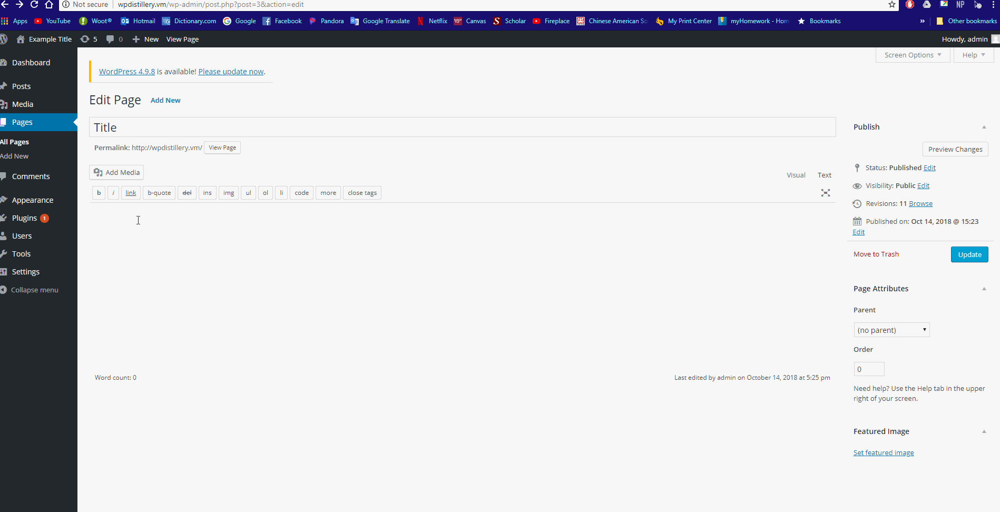

# Week-7-WordPress-vs-Kali

Time spent: 8 hours spent in total

> Objective: Find, analyze, recreate, and document **five vulnerabilities** affecting an old version of WordPress

## Pentesting Report

1. (Required) Unauthenticated Stored Cross-Site Scripting (XSS)
  - [ ] Summary: 
    - Vulnerability types:XSS
    - Tested in version: <=4.2
    - Fixed in version: 4.2.1
  - [ ] GIF Walkthrough: 
    
  - [ ] Steps to recreate: Commented on a post with the a message that was greater than 64kb causing the html to be displayed on the page where javascript could be inserted to attack.
  - [ ] Affected source code:
    - [Link 1]()
2. (Required) Authenticated Stored Cross-Site Scripting (XSS)
  - [ ] Summary: 
    - Vulnerability types: XSS
    - Tested in version: <= 4.2.2
    - Fixed in version: 4.2.3
  - [ ] GIF Walkthrough:
     
  - [ ] Steps to recreate: Made a post with the body having an onMouseOver() which would run whatever script if a viewer mouses over the item.
  - [ ] Affected source code:
    - [Link 1]()
3. (Required) Authenticated Shortcode Tags Cross-Site Scripting (XSS)
  - [ ] Summary: 
    - Vulnerability types: XSS
    - Tested in version:<= 4.3
    - Fixed in version: 4.2.5
  - [ ] GIF Walkthrough: 
     
  - [ ] Steps to recreate: Made a post with the body using shortcode tags and having an onMouseOver() which would run whatever script if a viewer mouses over the item.
  - [ ] Affected source code:
    - [Link 1]()
4. (Optional) User Enumeration
  - [ ] Summary: 
    - Vulnerability types: User Enumeration
    - Tested in version: 4.2
    - Fixed in version: 
  - [ ] GIF Walkthrough: 
    
  - [ ] Steps to recreate: Putting in a username that exists will tell you that the password is incorrect letting you know that the user exists
  - [ ] Affected source code:
    - [Link 1]()
5. (Optional) Posting iFrame
  - [ ] Summary: 
    - Vulnerability types: XSS
    - Tested in version: 4.2
    - Fixed in version: 
  - [ ] GIF Walkthrough: 
    
  - [ ] Steps to recreate: If a post contains an iFrame, it can include scripts that will be triggered when the page is loaded
  - [ ] Affected source code:
    - [Link 1]() 

## Assets

List any additional assets, such as scripts or files

## Resources

- [WordPress Source Browser](https://core.trac.wordpress.org/browser/)
- [WordPress Developer Reference](https://developer.wordpress.org/reference/)

GIFs created with [LiceCap](http://www.cockos.com/licecap/).

## Notes

The links contained a lot of information and sifting through it to figure out how to do the exploit was sometimes difficult

## License

    Copyright [2018] [Mitchell Liou]

    Licensed under the Apache License, Version 2.0 (the "License");
    you may not use this file except in compliance with the License.
    You may obtain a copy of the License at

        http://www.apache.org/licenses/LICENSE-2.0

    Unless required by applicable law or agreed to in writing, software
    distributed under the License is distributed on an "AS IS" BASIS,
    WITHOUT WARRANTIES OR CONDITIONS OF ANY KIND, either express or implied.
    See the License for the specific language governing permissions and
    limitations under the License.
